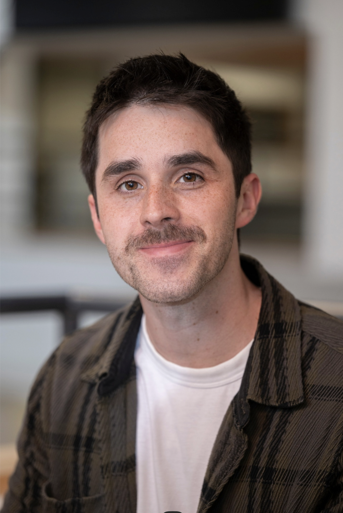

<section class="home-profile" aria-labelledby="home-name">

<nav class="home-links" aria-label="Profile and social links">
<a href="Data/Jameson_vitae.pdf">CV</a>
<a href="https://scholar.google.com/citations?user=jIrUgQsAAAAJ&amp;hl=en">Google Scholar</a>
<a href="mailto:jacobjameson@g.harvard.edu">Email</a>
<a href="https://www.linkedin.com/in/jacob-jameson">LinkedIn</a>
<a href="https://github.com/jacobjameson">GitHub</a>
<a href="https://twitter.com/JacobCJameson">Twitter</a>
<a href="https://letterboxd.com/jacobjameson/">Letterboxd</a>
</nav>

<header class="home-intro">
<h1 class="home-name" id="home-name">Jacob Jameson</h1>

PhD candidate at Harvard University

</header>

I am on the academic job market for 2026–2027. Please feel free to <a href="mailto:jacobjameson@g.harvard.edu">get in touch</a> or view my <a href="Data/Jameson_vitae.pdf">CV</a>.

I am a PhD candidate in Health Policy and Decision Sciences at Harvard University. <a href="research.qmd">My research</a> develops and applies methods in causal inference, decision modeling, and reinforcement learning to generate and synthesize evidence for better decision-making in health and public policy.

I study the impacts of physician behavior, health policies, and personalized medicine. I am an <a href="https://hsph.harvard.edu/research/causalab/suicideprevention/">NIMH T32 Predoctoral Research Fellow in Comparative Effectiveness Research for Suicide Prevention</a> at Brigham and Women’s Hospital and a Research Statistician with the U.S. Department of Veterans Affairs.

I also care deeply about <a href="teaching.qmd">teaching</a>. I have been fortunate to work with students at Harvard, the University of Chicago, and New Haven Public Schools during my time as a Teach For America corps member.

</section>

<aside class="home-news-rail" aria-labelledby="news-heading">
<h2 class="home-news-heading" id="news-heading">Recent updates</h2>

<article class="home-news-entry">
<time class="home-news-date" datetime="2026-08">August 2026</time>

Teaching Math Camp for incoming PhD students at Harvard Kennedy School.

</article>

<article class="home-news-entry">
<time class="home-news-date" datetime="2026-07">July 2026</time>

Presented at the <a href="https://meetings.informs.org/wordpress/healthcare2026/">INFORMS Healthcare Conference</a>.

</article>

<article class="home-news-entry">
<time class="home-news-date" datetime="2026-05">May 2026</time>

Awarded the <a href="https://www.hks.harvard.edu/more/about/leadership-administration/academic-deans-office/slate/research-and-innovation/making/teaching#recipients">Dean’s Award for Excellence in Student Teaching</a> by Harvard Kennedy School. <a href="https://chds.hsph.harvard.edu/jameson-wins-teaching-award-again/">Read the story</a>.

</article>

<article class="home-news-entry">
<time class="home-news-date" datetime="2026-05">May 2026</time>

Presented at the <a href="https://pomsmeetings.org/conf-2026/">36th Annual POMS Conference</a>.

</article>

Earlier updates

<article class="home-news-entry">
<time class="home-news-date" datetime="2026-05">May 2026</time>

Posted a preprint: <a href="https://www.medrxiv.org/content/10.64898/2026.05.06.26352568v1">The Effect of Legalizing Online Sports Gambling on Population Mental Health</a>.

</article>

<article class="home-news-entry">
<time class="home-news-date" datetime="2026-03">March 2026</time>

Selected for the <a href="https://sites.google.com/umich.edu/isye-mse-ioe-joint-rising-star/home">IOE–ISyE–MS&amp;E Rising Stars Workshop</a> and received the People’s Choice Award for my poster.

</article>

<article class="home-news-entry">
<time class="home-news-date" datetime="2026-03">March 2026</time>

Finalist in Harvard’s <a href="https://gsas.harvard.edu/academics/writing/three-minute-thesis">Three Minute Thesis Competition</a>.

</article>

<article class="home-news-entry">
<time class="home-news-date" datetime="2025-09">September 2025</time>

Finalist in the <a href="https://connect.informs.org/discussion/finalists-of-the-2025-informs-has-best-student-paper-competition">INFORMS HAS Best Student Paper Competition</a> — <a href="Data/INFORMS Award 2025.pdf">honorable mention</a>.

</article>

<article class="home-news-entry">
<time class="home-news-date" datetime="2025-06">June 2025</time>

<a href="Data/Distinction Award 2025.pdf">Awarded the Distinction in Student Teaching</a>, Harvard Kennedy School.

</article>

<article class="home-news-entry">
<time class="home-news-date" datetime="2024-05">May 2024</time>

Awarded the Distinction in Student Teaching and the Dean’s Award for Excellence in Student Teaching, Harvard Kennedy School.

</article>

<article class="home-news-entry">
<time class="home-news-date" datetime="2024-05">May 2024</time>

Awarded an NIMH T32 Predoctoral Fellowship in <a href="https://hsph.harvard.edu/research/causalab/suicideprevention/">Comparative Effectiveness Research for Suicide Risk Prevention</a>.

</article>

<article class="home-news-entry">
<time class="home-news-date" datetime="2024-02">February 2024</time>

<a href="https://chds.hsph.harvard.edu/chds-welcomes-new-educational-innovation-scholar/">Selected as the Center for Health Decision Science Educational Innovation Scholar</a>.

</article>

<article class="home-news-entry">
<time class="home-news-date" datetime="2024-02">February 2024</time>

Received the 2024 Howard Raiffa Award, Harvard Center for Risk Analysis.

</article>

<article class="home-news-entry">
<time class="home-news-date" datetime="2023-09">September 2023</time>

Finalist, INFORMS Public Sector OR Best Video Award — <a href="https://www.youtube.com/watch?v=do6j8G9qUoM">Improving Emergency Department Flow</a>.

</article>

<article class="home-news-entry">
<time class="home-news-date" datetime="2023-01">January 2023</time>

<a href="https://chds.hsph.harvard.edu/jameson-receives-raiffa-award/">Received the 2023 Howard Raiffa Award</a>, Harvard Center for Risk Analysis.

</article>

</aside>

