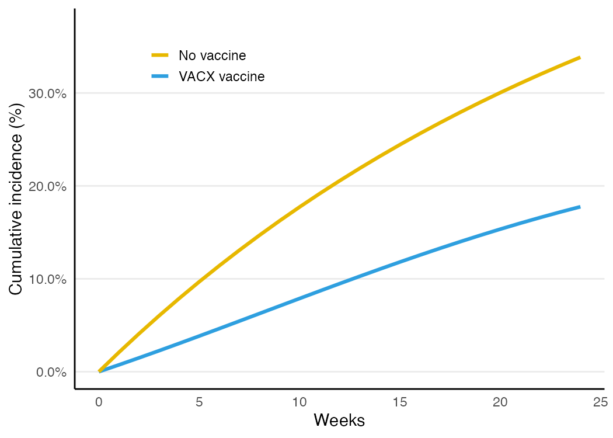
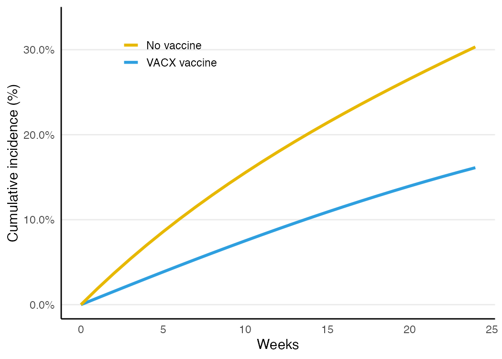
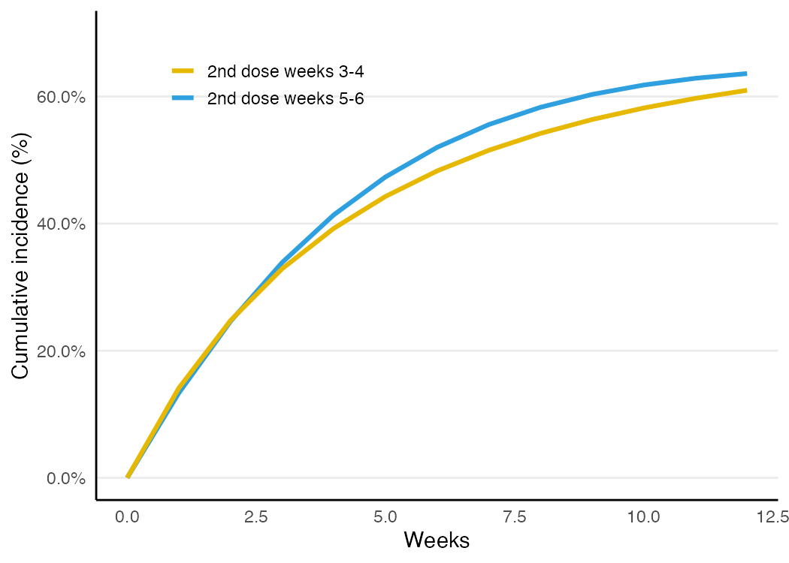

```{=html}
<style>
.chat { margin: 1.6em 0; }
.chat-user, .chat-claude {
  padding: 12px 16px; border-radius: 14px; margin: 10px 0; line-height: 1.5;
}
.chat-user {
  background: linear-gradient(135deg, #ede9fe, #e0e7ff);
  border: 1px solid #c7d2fe; margin-left: 8%;
}
.chat-claude {
  background: #f8f9fa; border: 1px solid #e5e7eb; margin-right: 8%;
}
.chat-user p:first-child, .chat-claude p:first-child { margin-top: 0; }
.chat-user p:last-child, .chat-claude p:last-child { margin-bottom: 0; }
.chat-user strong:first-child { color: #6d28d9; }
.chat-claude strong:first-child { color: #374151; }
.chat-user code, .chat-claude code { background: rgba(0,0,0,0.05); }
</style>
```

Most of the damage in observational research is done before a single model is fit. We ask a
question that isn't quite a question — "do statin users have less heart disease than non-users?" —
and then spend our energy on increasingly sophisticated estimators that can't rescue it. The fix is
not a fancier model. It's a discipline: **target trial emulation (TTE)**. Pin down the randomized
trial you *wish* you could run, then use your data to imitate it as faithfully as possible.

I built a small toolkit that makes that discipline easy to follow inside
[Claude Code](https://claude.com/claude-code): **[TTE_CC](https://github.com/jacobjameson/TTE_CC)**.
It's a set of interactive *skills* that interview you about your causal question and push back when
the design is unsound, plus a transparent R engine that does the estimation. This post explains what
it does and walks through real analyses you can reproduce.

::: column-margin
TTE_CC implements the target-trial-emulation framework from Hernán & Robins' *Causal Inference: What
If* and is built to be faithful to how TTE is taught by the Harvard CAUSALab. It's an independent,
open-source project (MIT).
:::

## Why "users vs. non-users" keeps failing

Two classic traps account for a huge share of observational studies that later disagree with trials:

- **Prevalent-user bias.** Comparing *current users* to *never users* compares survivors of treatment
  to everyone else. People who started and quit (or died) have already left the "current user" group.
- **Immortal time bias.** If you define someone as "treated" because they were treated *at some point
  during follow-up*, they had to survive long enough to get treated — manufacturing a survival
  advantage out of thin air.

Both are *design* errors, not data errors. No amount of regression fixes them. But they are also
completely avoidable — if you force yourself to specify the trial first.

## The two-step discipline

> **Step 1 — Ask.** Write down the protocol of the target trial: eligibility, treatment strategies,
> assignment, outcome, follow-up, the causal contrast, identifying assumptions, and the analysis plan.
>
> **Step 2 — Answer.** Emulate that trial in your data, adjusting for confounding to stand in for
> randomization — then *check* the emulation and report it honestly.

The slogan that organizes everything: *if you can't translate your question into a target trial, the
question isn't well-defined.*

## What TTE_CC gives you

TTE_CC is two things working together:

1. **Eight interactive skills** that cover the whole workflow:

| Stage | Skill | What it does |
|---|---|---|
| **Specify** | `target-trial` | Interviews you through the 8 protocol elements; refuses sloppy specs. |
| | `time-zero` | Aligns eligibility = assignment = start of follow-up; catches immortal-time designs. |
| | `competing-events` | Forces an explicit estimand when death competes with your outcome. |
| **Emulate** | `emulate-randomization` | Elicits the confounders; picks an adjustment method. |
| | `sustained-strategies` | Handles treatment sustained over time → g-methods, cloning, grace periods. |
| **Analyze** | `tte-estimate` | Writes readable R: matching, standardization, IP weighting, sequential trials, cloning. |
| **Check / Report** | `check-emulation` | Negative controls, balance, positivity — *falsify, don't verify.* |
| | `tte-report` | A write-up scaffold that keeps causal language out of the Results section. |

2. **A transparent R engine.** Every estimate is built from primitives you can read — a pooled
logistic discrete-time hazard turned into a risk curve, with bootstrap confidence intervals — so the
statistics never disappear into a black box.

Install the skills with one line:

```bash
curl -fsSL https://raw.githubusercontent.com/jacobjameson/TTE_CC/main/install.sh | bash
```

Then, in Claude Code, type `/target-trial` and start describing your question.

::: column-margin
The toolkit ships its **own** fully-synthetic teaching data describing a fictional vaccine, "VACX,"
built from a known data-generating mechanism. Because the truth is known, every example below can be
checked against it.
:::

## The skill in action: `/target-trial`

Here's the part that matters most, and it's a *conversation*. You open Claude Code, type
`/target-trial`, and describe your question the way most of us would. The skill won't let a sloppy
spec through — it interviews you and pushes back.

::: chat
::: {.chat-user}
**You** — `/target-trial` I want to estimate the effect of the VACX vaccine on coronavirus
hospitalization. I'll compare vaccinated vs. unvaccinated people in my claims data.
:::

::: {.chat-claude}
**Claude** — Before we touch the data, let's make this a *well-defined* causal question. A couple of
things in "vaccinated vs. unvaccinated people" will bias the answer:

- That's a **prevalent-user** contrast — it compares people at every stage of treatment, including
  survivors. We should compare **initiating VACX at baseline vs. not initiating**, classified at a
  common time zero. Does that match your decision question?
- Observational data can't emulate a placebo arm or blinding, so the comparator is **usual care**,
  open-label. OK?
- One more: is **death** possible during follow-up? It competes with hospitalization, so we'll need
  to pick an estimand rather than quietly drop it.
:::

::: {.chat-user}
**You** — Yes — the real question is whether starting VACX reduces hospitalization. And yes, some
people die during follow-up.
:::

::: {.chat-claude}
**Claude** — Good — that's an *initiator* design with death as a competing event. Let me pin down the
remaining protocol elements:

- **Eligibility** (assessed at baseline only): adults, no prior infection, no contraindication, no
  prior VACX. What's your washout window?
- **Time zero**: eligibility, treatment assignment, and start of follow-up must coincide — I'll route
  the details to `/time-zero` next so we don't create immortal time.
- **Confounders** to stand in for randomization: which baseline variables predict *both* getting
  vaccinated and being hospitalized? (age, comorbidity/risk, healthcare utilization, calendar time…)

Here's the protocol I'll write to `target_trial_protocol.md`:
:::
:::

The artifact it produces is the contract the rest of the analysis honors:

| Element | Specification |
|---|---|
| Eligibility | Adults, no prior infection/contraindication, no prior VACX (at baseline) |
| Strategies | (0) no vaccination · (1) first dose at baseline |
| Assignment | Emulated by adjusting for age, baseline risk, healthcare use |
| Outcome | 24-week hospitalization (time-to-event; death competes) |
| Follow-up | Baseline → event / death / loss to follow-up / 24 weeks |
| Contrast | Intention-to-treat (effect of initiation) |
| Assumptions | Exchangeability given baseline confounders; positivity |

Now the analysis can begin — and only now.

## First: the data has to be in the right shape

TTE has a specific data requirement that's easy to get wrong: everything runs on **long /
person-time** data — *one row per person per follow-up interval*. Covariates are recorded at the start
of each interval, treatment within it, and the outcome is a 0/1 flag for "did the event happen in this
interval." It looks like this:

```
id  time  age  treat  hosp
 1     0   52      1     0
 1     1   52      1     0
 1     2   52      1     1     # event in week 2 → hosp = 1 on this row
 2     0   67      0     0
```

Get this wrong — duplicate person-intervals, gaps in time, a wide one-row-per-person extract — and the
hazard/risk machinery silently produces nonsense. So the skills **check the format before doing
anything**, and won't proceed until it passes:

::: chat
::: {.chat-user}
**You** — Here's my extract: `claims.csv`. Go ahead and run the matched analysis.
:::

::: {.chat-claude}
**Claude** — First let me confirm the data are in person-time format — TTE needs one row per person per
interval.

```r
check_person_time(claims, id = "id", time = "week", outcome = "hosp")
#> Person-time format check:
#>   - 2,113 duplicate (id, week) rows — must be one row per person-interval
```

That won't work as-is — your file looks like one row per *claim*, not per person-week. It also has a
single `surv_weeks` + `event` per person in another table, so the clean fix is to expand that to
person-time:

```r
long <- to_person_time(person_level, id = "id", surv_time = "surv_weeks",
                       event = "hosp", K = 24, keep = c("age","baseline_risk","treat"))
check_person_time(long, outcome = "hosp")
#> Person-time format OK: 8,000 people, 162,199 person-intervals, time 0..23.
```

Now we can estimate. Want me to proceed with matching on the long data?
:::
:::

With the format guaranteed, the analyses below all "just work."

## Example 1: a randomized trial as the reference

When we *can* randomize, the analysis is simple. The engine fits a pooled logistic hazard and reads
off risk curves; a Kaplan–Meier estimator is a nonparametric cross-check.

```r
source("R/tte-helpers.R"); source("R/tte-plot.R")
load("data/vac_toy_random.rda")

km_risk(vac_toy_random, treat = "random", K = 24)              # nonparametric
pl <- pooled_logistic_risk(vac_toy_random, treat = "random", K = 24)  # parametric
pl$rd; pl$rr
```

```
KM   24-wk risk:  vaccine = 0.178   none = 0.338   RD = -0.161   RR = 0.52
PLR  24-wk risk:  vaccine = 0.178   none = 0.338   RD = -0.161   RR = 0.52
```

The two agree, and both land on the known truth (RD ≈ −0.171). The risk curves:

{width=75%}

Outcomes don't have to be time-to-event. A continuous endpoint (say an antibody titer at 24 weeks)
is a one-liner, and a single binary endpoint works the same way:

```r
point_effect(vac_toy_random, treat = "random", outcome = "titer", type = "continuous")
#> mean difference ≈ +119.8
```

## Example 2: emulating the trial with observational data

Now the realistic case: treatment wasn't randomized, and sicker, older, more health-seeking people
were more likely to get vaccinated. The naive comparison is confounded toward the null. With the
protocol settled, you just ask for the estimate:

::: chat
::: {.chat-user}
**You** — Looks right. Estimate it on `vac_toy_obs`, emulating randomization by matching on the
baseline confounders.
:::

::: {.chat-claude}
**Claude** — I'll use `/tte-estimate` in `matching` mode: 1:1 exact/coarsened matching on the
confounders, then read off 24-week risks on the matched cohort (marginally — after matching no further
adjustment is needed). I'll bootstrap by resampling people, re-running the match inside each resample,
and check balance with `cobalt`. Here's the script:
:::
:::

```r
load("data/vac_toy_obs.rda")
conf <- c("age_cat", "sex", "race", "urban", "baseline_risk")

naive   <- pooled_logistic_risk(vac_toy_obs, treat = "treat", K = 24)
matched <- match_cohort(vac_toy_obs, "treat", covariates = conf)
est     <- pooled_logistic_risk(matched, "treat", K = 24)   # marginal after matching

# covariate balance before vs after matching
cobalt::love.plot(attr(matched, "match"), stats = "mean.diffs", abs = TRUE,
                  thresholds = c(m = .1))
```

| Analysis | 24-week risk difference |
|---|---|
| Naive (confounded) | −0.088 |
| **Matched** | **−0.142** |
| Truth | −0.171 |

Matching moves the estimate from a badly attenuated −0.088 toward the truth. The `check-emulation`
skill confirms balance with a **love plot** — standardized differences before vs. after matching. The
covariates start out imbalanced (the treated are older and higher-risk) and collapse to ~0 after exact
matching:

{width=80%}

With the groups now comparable, the risk curves are interpretable:

{width=75%}

## Example 3: inverse-probability weighting (and informative dropout)

IP weighting is the other workhorse. It also handles **informative loss to follow-up** with
inverse-probability-of-censoring weights (IPCW). The whole pipeline — weights and model — is re-run
inside the bootstrap so the confidence interval is honest.

```r
w  <- ip_weights(vac_toy_obs, "treat", covariates = conf, K = 24, censor = "censor")
est <- pooled_logistic_risk(w[w$censor == 0 & w$death == 0, ],
                            "treat", K = 24, weights = "w")

boot_tte(vac_toy_obs,
  function(d) {
    ww <- ip_weights(d, "treat", covariates = conf, K = 24, censor = "censor")
    r  <- pooled_logistic_risk(ww[ww$censor == 0 & ww$death == 0, ], "treat", K = 24, weights = "w")
    c(rd = r$rd, rr = r$rr)
  }, R = 500, id = "id")
```

```
IPTW + IPCW   RD = -0.150   95% CI (-0.174, -0.132)
stabilized weights: mean = 0.99, max = 2.0 (truncated at 99th pct)
```

{width=75%}

## Example 4: competing events — there is no single answer

Death competes with hospitalization: a person who dies can never be hospitalized. There isn't one
"effect" here — there are several estimands, and they answer different questions. `competing-events`
makes you choose, and flags the common trap of *silently censoring at death* (which targets an
ill-defined "had no one died" effect).

```r
for (e in c("total", "composite", "controlled")) {
  d <- competing_events_transform(w, estimand = e, K = 24)
  print(pooled_logistic_risk(d, "treat", K = 24, covariates = conf)$rd)
}
```

| Estimand | What it asks | RD |
|---|---|---|
| **Total effect** | Effect on hospitalization, deaths kept "eternally outcome-free" | −0.147 |
| **Composite** | Effect on (hospitalization *or* death) | −0.134 |
| **Controlled direct** | "Had no one died" — ill-defined; strong assumption | −0.150 |

The point isn't which number is right; it's that you state the question *before* you pick the
transform, and report the assumption each one rests on.

## Example 5: sustained strategies and the cloning trick

The hardest — and most interesting — case is strategies that are **indistinguishable at time zero**.
Suppose everyone gets a first dose at baseline, and the strategies differ only in *when* the second
dose is taken: "by week 3" vs. "by week 5." You cannot assign arms from baseline data without
inviting immortal-time bias.

::: chat
::: {.chat-user}
**You** — Now I want the effect of getting the second dose *earlier* — by week 3 vs. by week 5. Can I
just compare people who took it at each time?
:::

::: {.chat-claude}
**Claude** — Careful — that's a sustained strategy that's **indistinguishable at time zero**: at
baseline everyone looks identical, and you only learn the timing later. Comparing observed week-3 vs.
week-5 takers is a *naive per-protocol* analysis, and it's badly confounded — people who delay are
systematically different (and you'd be selecting on the future). I'll switch to `/sustained-strategies`
and use **cloning–censoring–weighting**: clone each person into both arms, censor a clone when its
data deviate from its assigned timing, and IP-weight to undo that censoring. Let me show you both so
you can see the difference:
:::
:::

In the synthetic data, where the truth is known, the naive comparison doesn't just shrink the effect —
it gets the **sign wrong**:

```r
load("data/vac_toy_tv.rda")
conf <- c("symp", "symp_lag1", "age", "baseline_risk")

both <- clone_censor_weight(vac_toy_tv, covariates = conf,
                            arm0 = c(3, 3), arm1 = c(5, 5), K = 12)
pooled_logistic_risk(both[!is.na(both$hosp), ], treat = "arm", time = "time",
                     K = 12, weights = "w")
```

| Analysis | RD (2nd dose wk 5 vs wk 3) |
|---|---|
| Naive per-protocol | **−0.141** ← confounded, *wrong sign* |
| **Cloning + IP weighting** | **+0.013** |
| Truth | +0.053 |

The cloning approach — **clone** each person into both arms, **censor** a clone when its data deviate
from its assigned strategy, and **IP-weight** to undo the censoring selection — recovers the correct
direction (later second dose is worse) where the naive analysis points the opposite way. The residual
gap from the exact truth reflects the parametric hazard approximation and positivity for exact-timing
adherers — which is exactly why **grace periods** help.

{width=75%}

Real strategies rarely demand an action on an exact day. Allowing a *window* — "second dose in weeks
3–4" vs. "5–6" — gives more adherent clones and better positivity. The same one function handles it,
just with a wider window:

```r
clone_censor_weight(vac_toy_tv, covariates = conf, arm0 = c(3, 4), arm1 = c(5, 6), K = 12)
#> grace period: RD = +0.026 — closer to the truth (+0.053) than exact timing
```

{width=75%}

## Why it's built this way

A few choices I'd defend:

- **The question comes first, enforced.** The specification skills are deliberately opinionated. They
  will not let you run a prevalent-user contrast or a misaligned time zero without a fight. That
  friction is the point.
- **Transparent code, not a black box.** The engine is a few hundred lines of readable R built from
  hazards and cumulative products. You can audit every estimate. (Where mature packages like
  `TrialEmulation` cover the same ground, you can cross-check against them — but they're not a
  dependency.)
- **Truth you can check against.** The bundled data are synthetic with a known data-generating
  mechanism, so the examples and the 50-test suite *prove* the estimators recover the truth and that
  naive analyses are biased — including the wrong-sign cloning example above.
- **Honesty by construction.** Confounding adjustment can never be *verified*, only *falsified*. The
  `check-emulation` skill leans into negative controls, balance, and positivity, and `tte-report`
  keeps causal language out of the Results section.

## Using it on your own research

The workflow is the same for your data:

1. `/target-trial` — specify the protocol; let it push back.
2. `/time-zero` — align eligibility, assignment, and start of follow-up.
3. `/emulate-randomization` (and `/sustained-strategies` if treatment is sustained) — pick confounders
   and a method.
4. `/tte-estimate` — generate the analysis script.
5. `/check-emulation` and `/tte-report` — falsify and write up.

And the checking step is a conversation too — the skill is built around the idea that you can never
*prove* there's no unmeasured confounding, only look for evidence against your design:

::: chat
::: {.chat-user}
**You** — How much should I trust the −0.15? Can we stress-test it?
:::

::: {.chat-claude}
**Claude** — We can't *verify* no-unmeasured-confounding — only try to *falsify* it. With
`/check-emulation` I'll: (1) confirm covariate balance after weighting (here, standardized differences
are ~0); (2) inspect the weight distribution for positivity problems (mean ≈ 1, max ≈ 2 after
truncation — healthy); and (3) run a **negative-control outcome** — something VACX shouldn't affect
but with similar confounding. If that comes back non-null, it's a red flag for residual bias. Want me
to set up a negative control from your data?
:::
:::

One honest caveat: target trial emulation removes *design* biases (immortal time, prevalent-user
selection). It does **not** remove *data* biases. If the confounders you need aren't in your data,
the estimate will be confounded — and the toolkit will tell you so rather than paper over it.

The repo, with full docs and runnable examples, is here:
**[github.com/jacobjameson/TTE_CC](https://github.com/jacobjameson/TTE_CC)**. If you try it on a real
question, I'd love to hear how it goes.
